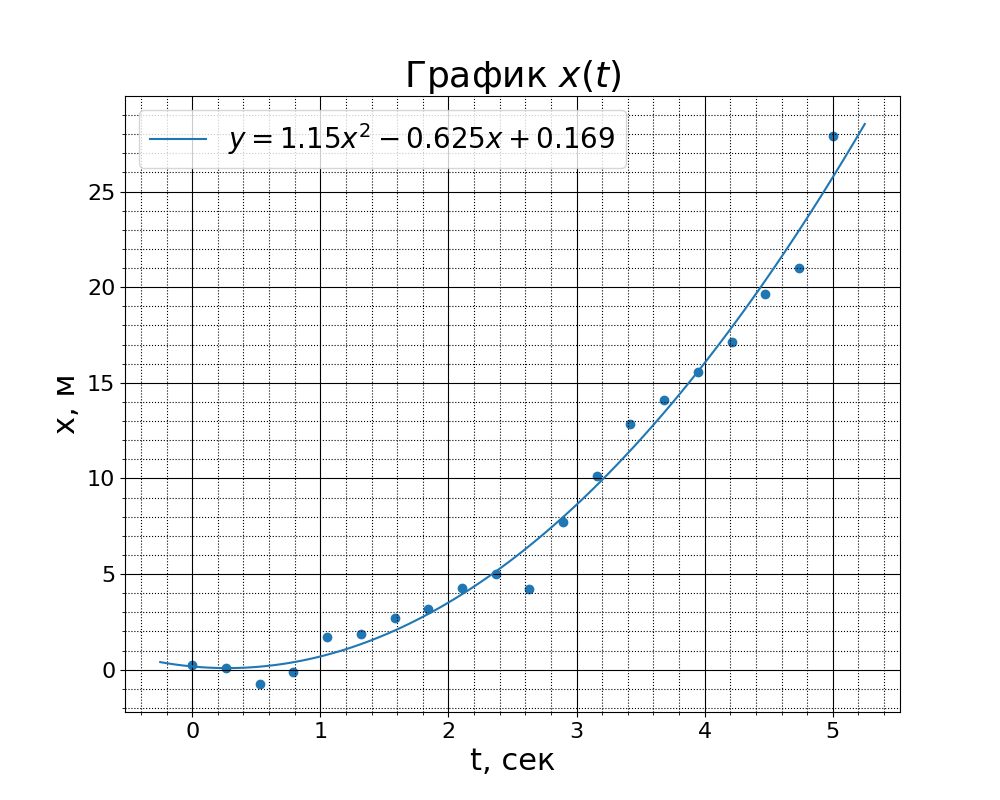

Быстрый старт
=============

Возможности
-----------

* Построения графиков по всем правилам оформления

* Удобная аппроксимация точек графика

    * Линейная
    * Полиномиальная
    * Экспоненциальная
    * Логарифмическая
    * Lowess
    * На основе преобразования Фурье (WIP)
    * На основе любой пользовательской функции

* Удобная интерполяция точек графика

    * Квадратическая

* Преобразования таблиц pandas в таблицы latex

Требуемые зависимости
----------------------

* matplotlib
* numpy
* scipy
* pandas
* statsmodels

Установка
---------

Используя ``pip``\ ...

.. code:: bash

    $ pip install miptlabs

Использование
-------------

Рекомендуется использовать jupyter notebook для выполнения лабораторных!!!!!

Просто рисование графика

.. code:: python

    from miptlabs.plotter import pretty_plot, show
    from numpy import linspace

    # точки для построения графика
    x = linspace(0, 5, 20)
    y = x * x # рисуем параболу

    pretty_plot(x, y)
    show()

Получается

.. figure:: _static/images/base.png
       :align: center
       :alt: Простой пример

По умолчанию рисуются точки, не соединённые линиями. Так сделано, так как точки в 99% случаев вы будите чем-то аппроксимировать.

Точки можно соединить, дописав line=True, и удалить их выделение, дописав points=False. Также можно добавить легенду к графику с помощью атрибута legend.

.. code:: python

    pretty_plot(x, y, legend='$y = x^2$', line=True)

.. figure:: _static/images/with_line.png
       :align: center
       :alt: Пример сложнее

Так как для данный с лаб простое соединение вряд ли подойдет, то в пакете есть разные апроксиматоры Для примера можно
взять зависимость координаты от рвемени при равноускоренном движении

.. code:: python

    from src.miptlabs.plotter import pretty_plot, show
    from src.miptlabs.approximators import Polynomial
    from numpy import linspace
    import numpy as np

    # точки для построения графика
    x = linspace(0, 5, 20)
    y = x * x + np.random.normal(size=x.shape)
    ax = pretty_plot(x, y, legend='$x = t^2$ + random')

    # Апроксимация
    approximator = Polynomial(deg=2)
    appr_x, appr_y = approximator.approximate(x, y)
    # Вывод формулы для латеха
    print(approximator.label('t', 'x'))
    # >>> $y = 1.03t^{2}-0.205t+0.158$

    # Построение графика. Параметры говорят сами за себя
    pretty_plot(appr_x, appr_y, axes=ax, points=False, line=True,
                legend=approximator.label('t', 'x'), xlabel='t, сек', ylabel='x, м', title='График $x(t)$')

    ax.figure.savefig('examples/approx.png')
    show()

